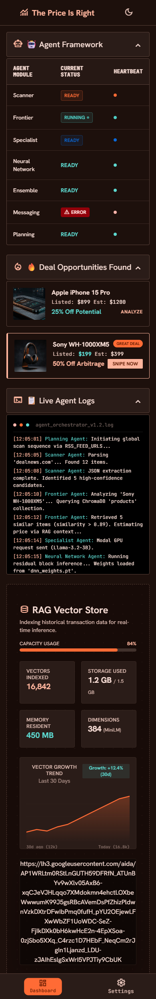
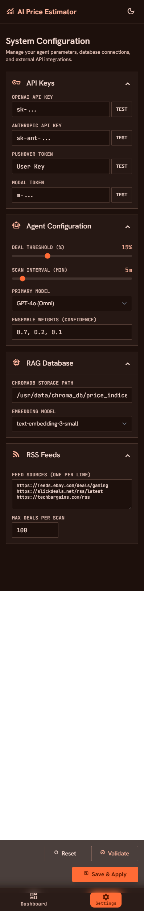
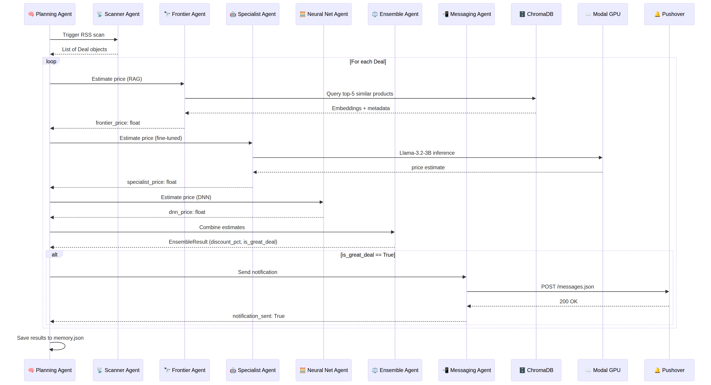
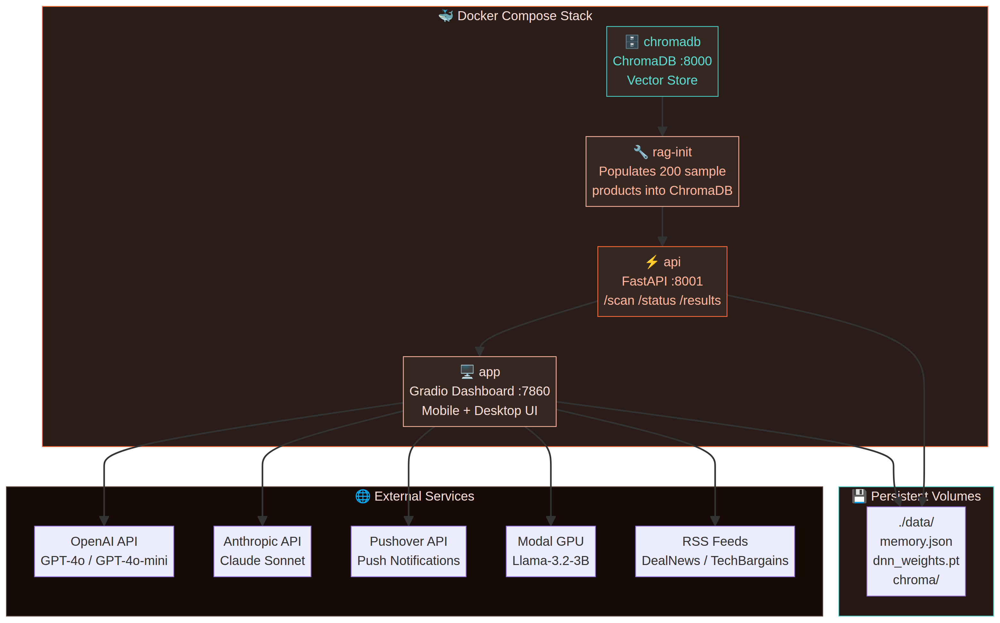

# 📊 The Price Is Right — AI Deal Hunter

**The Price Is Right** is a modular, Docker-based, multi-agent AI application designed to autonomously hunt for online product deals. It watches RSS feeds, estimates the true market price of products using an ensemble of 7 specialized AI models, and sends push notifications when it discovers significant arbitrage opportunities.

> **Author:** Lalit Nayyar | lalitnayyar@gmail.com | +971508320336 | +919595353336
> **Repository:** https://github.com/lalitnayyar/priceisright.git
> **Current Version:** v1.5.0

---

## 📸 Application Screenshots

### 🖥️ Dashboard View
The main dashboard provides a real-time view of the agent framework, recently discovered deals, live terminal logs, and the RAG vector store capacity.



### ⚙️ Settings View
The live settings page allows you to configure API keys, agent parameters, ensemble weights, and RSS feeds on the fly without restarting the application.



---

## 🧠 7-Agent AI Framework

The core of the application is a pipeline orchestrated by 7 distinct AI agents working in harmony:



| # | Agent | Model | Role |
|---|-------|-------|------|
| 1 | **Scanner Agent** | GPT-4o-mini | Parses RSS feeds, extracts product listings, and identifies best deal candidates using structured JSON outputs |
| 2 | **Frontier Agent** | GPT-4o + RAG | Queries ChromaDB for similar historical products and uses retrieved context to estimate true market price |
| 3 | **Specialist Agent** | Llama-3.2-3B (Modal GPU) | Calls a fine-tuned model hosted on Modal GPU, trained specifically on product price prediction |
| 4 | **Neural Network Agent** | PyTorch DNN | Runs product features through a local 5-layer residual Deep Neural Network for offline price estimation |
| 5 | **Ensemble Agent** | Heuristic Combiner | Aggregates estimates from Frontier, Specialist, and DNN agents using configurable weights |
| 6 | **Messaging Agent** | Claude 3.5 Sonnet | Crafts compelling push notification messages and sends via Pushover API |
| 7 | **Planning Agent** | GPT-4o Orchestrator | Coordinates the entire pipeline, handles parallel execution, logs every step, and saves results |

---

## 🏗️ Architecture & Docker Services

The application is fully containerized and consists of four main Docker services:



| Service | Image | Port | Role |
|---------|-------|------|------|
| `chromadb` | `chromadb/chroma:0.4.24` | 8000 | Persistent vector database storing product embeddings |
| `rag-init` | Custom Python build | — | One-off initialization script that populates ChromaDB with sample data |
| `api` | Custom Python build | 8001 | FastAPI REST API layer handling background tasks and state management |
| `app` | Custom Python build | 7860 | Gradio-based web UI providing the dashboard and settings interface |

---

## 🚀 User Guide & Quick Start

### Prerequisites

- **Docker Desktop** (v4.x or later) with WSL2 integration enabled
- **Git** installed
- **API Keys:** OpenAI (Required), Anthropic (Required), Pushover (Required for notifications), Modal (Optional for Specialist Agent)

### Step 1 — Clone the Repository

```bash
git clone https://github.com/lalitnayyar/priceisright.git
cd priceisright/priceisrightcapstone
```

### Step 2 — Configure Environment

Copy the example environment file and fill in your API keys:

```bash
cp .env.example .env
```

Open `.env` and add your keys:

```bash
OPENAI_API_KEY=sk-...
ANTHROPIC_API_KEY=sk-ant-...
PUSHOVER_USER=your_pushover_user_key
PUSHOVER_TOKEN=your_pushover_app_token
MODAL_TOKEN_ID=ak-...          # Optional
MODAL_TOKEN_SECRET=...         # Optional
DEAL_THRESHOLD=50              # % discount to trigger notification
SCAN_INTERVAL_MINUTES=5
```

### Step 3 — Diagnose Your Environment (Recommended)

Before deploying, run the built-in diagnostic to check Docker, Compose, ports, and `.env` keys:

```bash
chmod +x manage.sh
./manage.sh diagnose
```

### Step 4 — Deploy

**Linux / macOS / WSL2:**
```bash
./manage.sh deploy
```

**Windows (PowerShell):**
```powershell
.\manage.ps1 deploy
```

Once deployed, access the application at:

| Interface | URL |
|-----------|-----|
| **Gradio Dashboard** | http://localhost:7860 |
| **FastAPI REST API** | http://localhost:8001 |
| **ChromaDB API** | http://localhost:8000 |

> **Note:** First build downloads ~750 MB of Python packages (PyTorch, Transformers, etc.) and takes approximately 10–15 minutes. Subsequent builds use Docker layer cache and complete in under 30 seconds.

---

## 🛠️ Management Commands

Use `manage.sh` (Linux/macOS/WSL2) or `manage.ps1` (Windows PowerShell) to control the application:

| Command | Linux | Windows | Description |
|---------|-------|---------|-------------|
| `deploy` | `./manage.sh deploy` | `.\manage.ps1 deploy` | Pull latest code, build images, and start all containers |
| `update` | `./manage.sh update` | `.\manage.ps1 update` | Pull latest code and rebuild/restart containers |
| `start` | `./manage.sh start` | `.\manage.ps1 start` | Start all containers in the background |
| `stop` | `./manage.sh stop` | `.\manage.ps1 stop` | Stop all running containers |
| `restart` | `./manage.sh restart` | `.\manage.ps1 restart` | Restart all services without rebuild |
| `patch` | `./manage.sh patch` | `.\manage.ps1 patch` | Apply quick code patch and restart app/api services only |
| `test` | `./manage.sh test` | `.\manage.ps1 test` | Run 118-test suite and generate Markdown report |
| `status` | `./manage.sh status` | `.\manage.ps1 status` | Show current status of all Docker containers |
| `logs` | `./manage.sh logs` | `.\manage.ps1 logs` | Stream logs from all services |
| `diagnose` | `./manage.sh diagnose` | `.\manage.ps1 diagnose` | Check Docker, Compose, `.env` keys, and port availability |

---

## 🧪 Testing

The project includes a comprehensive test suite (118 tests) that validates agent logic, data models, and API endpoints.

```bash
./manage.sh test
```

Test results are automatically exported as timestamped Markdown files in the `tests/reports/` directory.

---

## 🐛 Troubleshooting Guide

This section documents every known issue and its resolution, in the order they were encountered during deployment.

---

### Issue 1 — `docker-compose: command not found` in WSL2

**Symptom:**
```
The command 'docker-compose' could not be found in this WSL 2 distro.
```

**Root Cause:** Docker Desktop on WSL2 uses the new Compose V2 plugin (`docker compose` with a space). The legacy standalone binary `docker-compose` (with a hyphen) is not installed in the WSL2 distro by default.

**Fix Applied:** `manage.sh` and `manage.ps1` were updated to auto-detect which variant is available:
- Tries `docker compose` (V2 plugin) first — preferred
- Falls back to `docker-compose` (legacy binary) if V2 not found
- Exits with clear install instructions if neither is found

**If Docker daemon is unreachable in WSL2:**
1. Open Docker Desktop → **Settings → Resources → WSL Integration**
2. Enable the toggle for your distro (e.g., `Ubuntu`)
3. Click **Apply & Restart**
4. Open a new WSL2 terminal and retry

---

### Issue 2 — `No matching distribution found for torch==2.0.1+cpu`

**Symptom:**
```
ERROR: Could not find a version that satisfies the requirement torch==2.0.1+cpu
ERROR: No matching distribution found for torch==2.0.1+cpu
```

**Root Cause:** The `+cpu` local version identifier is only available from the PyTorch wheel server (`https://download.pytorch.org/whl/cpu`), not from PyPI. Docker's default pip resolves against PyPI only.

**Fix Applied:** Changed `requirements.txt` to use plain `torch==2.0.1` (available on PyPI, runs on CPU identically):

```diff
- torch==2.0.1+cpu --extra-index-url https://download.pytorch.org/whl/cpu
+ torch==2.0.1
```

---

### Issue 3 — `AttributeError: module 'torch.utils._pytree' has no attribute 'register_pytree_node'`

**Symptom:**
```
AttributeError: module 'torch.utils._pytree' has no attribute 'register_pytree_node'.
Did you mean: '_register_pytree_node'?
```

**Root Cause:** A Python package version conflict between `sentence-transformers`, `transformers`, and `torch`:

| Package | Old Version | Problem |
|---------|-------------|---------|
| `sentence-transformers` | 2.2.2 | Pulled `transformers ~4.26` |
| `transformers` | ~4.26 | Called `torch.utils._pytree.register_pytree_node()` |
| `torch` | 2.1.1 | Renamed the function to `_register_pytree_node` |

**Fix Applied:** Pinned all three packages to mutually compatible versions:

```
torch==2.0.1
transformers==4.35.2
tokenizers==0.15.0
huggingface-hub==0.19.4
sentence-transformers==2.3.1
```

---

### Issue 4 — ChromaDB container unhealthy / dependency failed to start

**Symptom:**
```
✘ Container priceisrightcapstone-chromadb-1  Error  dependency chromadb failed to start
dependency failed to start: container priceisrightcapstone-chromadb-1 is unhealthy
```

**Root Cause:** Two problems combined:
1. The `chromadb/chroma:latest` image does not include `curl`, so the healthcheck command `curl -f http://localhost:8000/api/v1/heartbeat` always failed with `exec: curl: not found`
2. Using `:latest` pulled `0.5.x` which has a longer startup time than the healthcheck timeout allowed

**Fix Applied:**

```yaml
# docker-compose.yml
chromadb:
  image: chromadb/chroma:0.4.24   # ← pinned to stable version
  healthcheck:
    # Use python3 urllib (always available) instead of curl
    test: ["CMD", "python3", "-c",
      "import urllib.request; urllib.request.urlopen('http://localhost:8000/api/v1/heartbeat')"]
    interval: 15s
    timeout: 10s
    retries: 8
    start_period: 20s             # ← give ChromaDB time to initialise
```

Also bumped `chromadb==0.4.18` → `chromadb==0.4.24` in `requirements.txt` to match.

---

### Issue 5 — Invisible text in Settings UI (dark text on dark background)

**Symptom:** All text inside input fields, textboxes, dropdowns, status boxes, and warning messages was invisible — dark text rendered on a dark background.

**Affected elements visible in screenshots:**
- API key input fields (OpenAI, Anthropic, Pushover, Modal)
- Test result status boxes ("⚠️ Invalid format", "⚠️ Key missing", "⚠️ Token missing")
- Dropdown selected values (Log Level, Pushover Sound, etc.)
- Number inputs (Dashboard Port, API Port)
- Slider value displays
- Status / validation message output boxes
- RSS feed textarea

**Root Cause:** Gradio's `Base` theme applies internal CSS variables that set input text to near-black. The `-webkit-text-fill-color` property (used by Chrome/Chromium) overrides the `color` property entirely, making text invisible even when `color` was explicitly set in custom CSS.

**Fix Applied:** A comprehensive CSS block was added to `dashboard.py` using `!important` overrides on every affected selector:

```css
/* All textbox inputs and textareas */
input[type="text"],
input[type="password"],
input[type="number"],
textarea,
[data-testid="textbox"] input,
[data-testid="textbox"] textarea,
.block textarea,
.block input {
    color: #f7ddd5 !important;
    background-color: #1a0a00 !important;
    caret-color: #ffb59d !important;
    -webkit-text-fill-color: #f7ddd5 !important;  /* ← critical for Chrome/WSL2 */
}
```

Additional selectors were added for: read-only outputs, dropdowns, number inputs, slider value displays, code blocks, accordion labels, markdown prose, and Gradio v4 svelte-generated wrappers.

**To apply without rebuild:**
```bash
./manage.sh patch    # pulls latest + restarts app/api only (no image rebuild)
```

---

## 📋 Full Changelog

| Version | Commit | Date | Change |
|---------|--------|------|--------|
| v1.5.0 | `be3b6bd` | 2026-07-01 | **fix:** Force bright text visibility on all Gradio input/output/status elements |
| v1.4.0 | `d5af178` | 2026-07-01 | **fix:** Pin chromadb to 0.4.24, fix healthcheck to use python3 urllib instead of curl |
| v1.3.1 | `41adaf9` | 2026-07-01 | **fix:** Remove torch `+cpu` suffix — use plain `torch==2.0.1` from PyPI |
| v1.3.0 | `f3377df` | 2026-07-01 | **fix:** Auto-detect `docker compose` v2 vs legacy, add WSL2 guidance and `diagnose` command |
| v1.2.0 | `bf518a8` | 2026-07-01 | **fix:** Resolve torch/transformers/sentence-transformers version conflict; add `.dockerignore`; add healthchecks |
| v1.1.0 | `4338174` | 2026-07-01 | **docs:** Add detailed README with architecture diagrams and screenshots |
| v1.0.0 | Initial | 2026-07-01 | **feat:** Initial release — 7-agent pipeline, Gradio UI, FastAPI, Docker Compose, manage scripts |

---

## 📁 Project Structure

```
priceisright/
├── priceisrightcapstone/
│   ├── app/
│   │   ├── agents/
│   │   │   ├── base.py          ← Abstract Agent base class
│   │   │   ├── scanner.py       ← Agent 1: RSS parsing (GPT-4o-mini)
│   │   │   ├── frontier.py      ← Agent 2: RAG price estimation (GPT-4o + ChromaDB)
│   │   │   ├── specialist.py    ← Agent 3: Fine-tuned Llama via Modal GPU
│   │   │   ├── dnn.py           ← Agent 4: Deep Residual Neural Network (PyTorch)
│   │   │   ├── ensemble.py      ← Agent 5: Weighted average combiner
│   │   │   ├── messaging.py     ← Agent 6: Claude + Pushover notifications
│   │   │   └── planning.py      ← Agent 7: Pipeline orchestrator
│   │   ├── core/
│   │   │   ├── config.py        ← All 24 environment variables (pydantic-settings)
│   │   │   ├── models.py        ← Deal, EnsembleResult, DealResult, AgentStatus
│   │   │   └── rag.py           ← ChromaDB + sentence-transformers RAG wrapper
│   │   ├── ui/
│   │   │   └── dashboard.py     ← Full Gradio UI (Dashboard + Settings tabs)
│   │   └── api.py               ← FastAPI REST layer (/scan, /status, /results)
│   ├── tests/
│   │   ├── test_agents.py       ← 118-test suite
│   │   └── reports/             ← Auto-generated Markdown test reports
│   ├── scripts/
│   │   └── run_tests.py         ← Test runner with Markdown report generation
│   ├── data/                    ← ChromaDB storage, DNN weights, memory store
│   ├── main.py                  ← Entry point (--mode dashboard|api|init-rag)
│   ├── Dockerfile               ← Multi-stage Python 3.11-slim build
│   ├── docker-compose.yml       ← 4-service Compose stack
│   ├── requirements.txt         ← Pinned dependencies (all version conflicts resolved)
│   ├── .env.example             ← Environment variable template
│   ├── .dockerignore            ← Build context exclusions
│   ├── manage.sh                ← Linux/macOS/WSL2 management script
│   └── manage.ps1               ← Windows PowerShell management script
├── docs/
│   ├── architecture.d2          ← D2 source for architecture diagram
│   ├── agent_pipeline.mmd       ← Mermaid source for agent sequence diagram
│   ├── docker_services.mmd      ← Mermaid source for Docker services diagram
│   └── screenshots/             ← All diagram and UI screenshots
├── MEMORY.md                    ← Standing project rules (always push to GitHub)
└── README.md                    ← This file
```

---

## 📝 Disclaimer

This project is developed and maintained by **Lalit Nayyar**.

| Contact | Details |
|---------|---------|
| Email | lalitnayyar@gmail.com |
| Mobile (UAE) | +971508320336 |
| Mobile (India) | +919595353336 |
| GitHub | https://github.com/lalitnayyar/priceisright |
