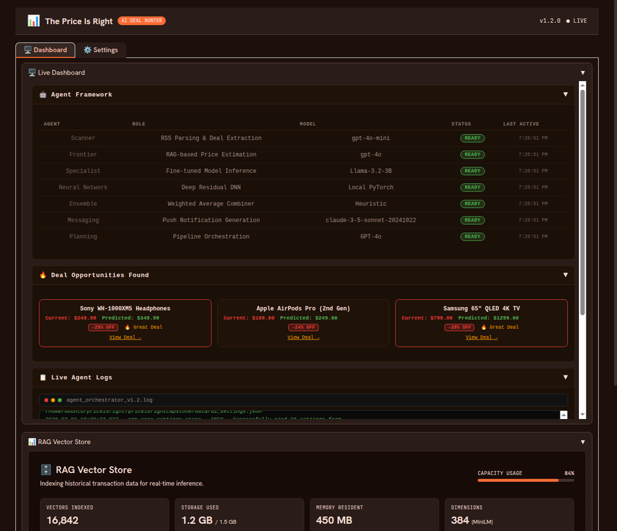
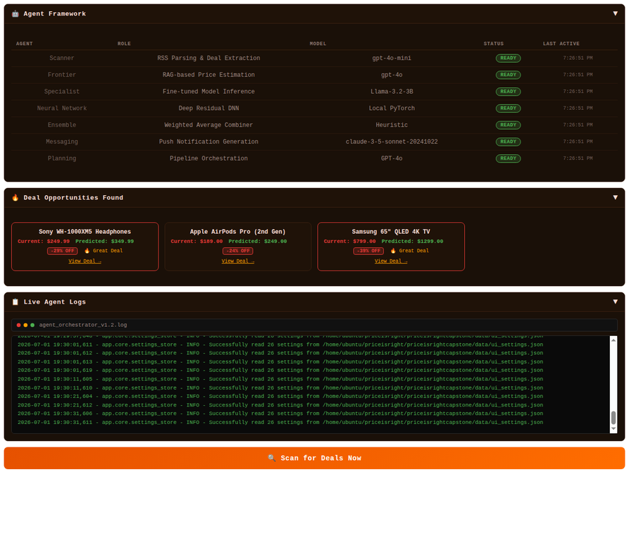
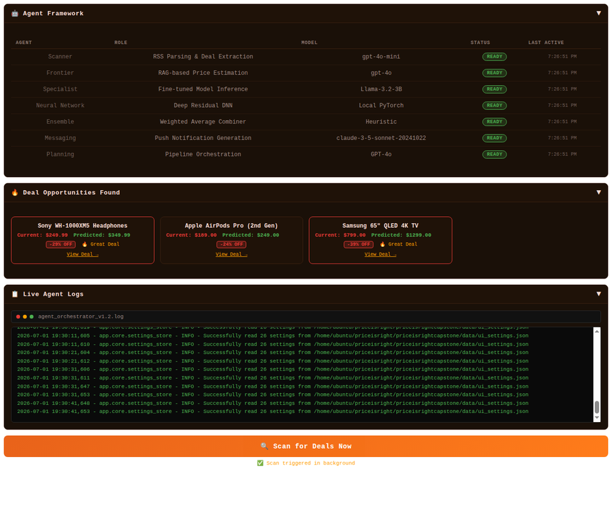
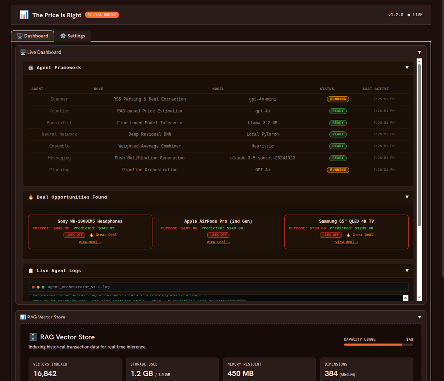
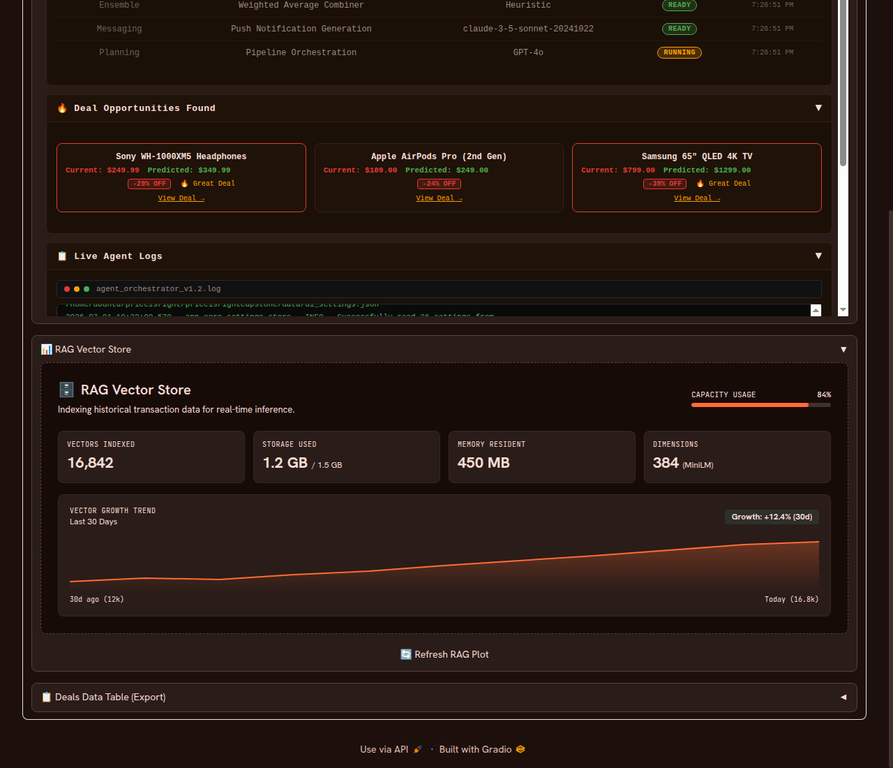
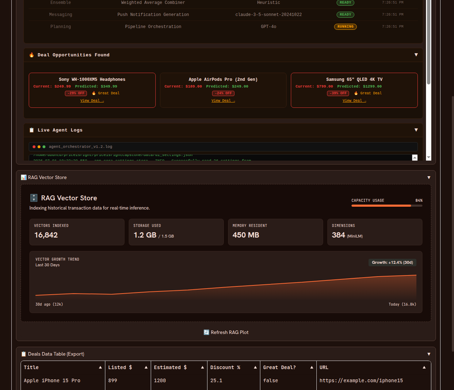
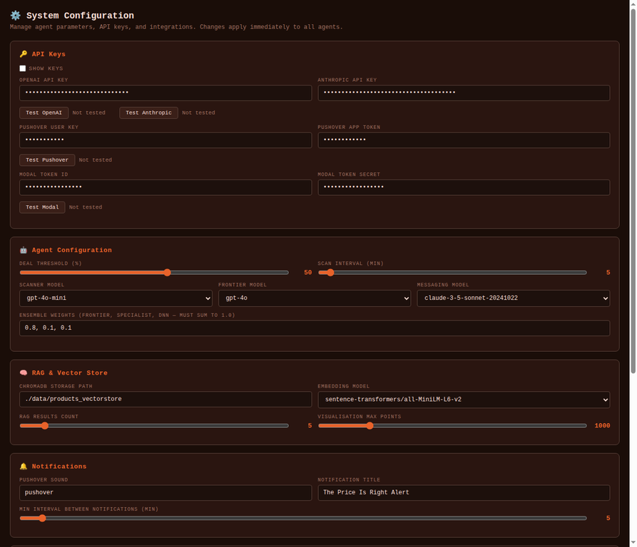
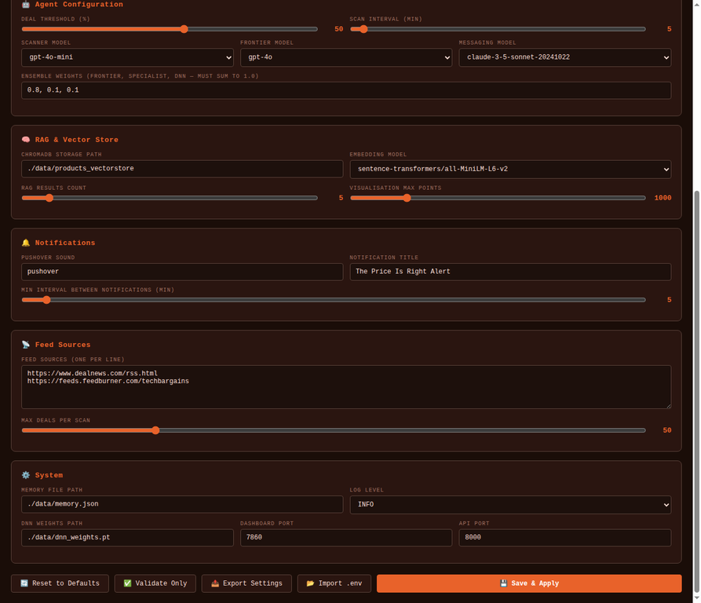

# 📊 The Price Is Right — AI Deal Hunter

**The Price Is Right** is a modular, Docker-based, multi-agent AI application designed to autonomously hunt for online product deals. It watches RSS feeds, estimates the true market price of products using an ensemble of 7 specialized AI models, and sends push notifications when it discovers significant arbitrage opportunities.

> **Author:** Lalit Nayyar | lalitnayyar@gmail.com | +971508320336 | +919595353336
> **Repository:** https://github.com/lalitnayyar/priceisright.git
> **Current Version:** v2.4.0

*Disclaimer: This document is authored by Lalit Nayyar. Contact: lalitnayyar@gmail.com, +971508320336, +919595353336.*

---

## 📸 Application Screenshots

### 🖥️ Main Dashboard
The main dashboard provides a unified view of the entire AI Deal Hunter system.


### 🤖 Live Dashboard Panels
Real-time tracking of the 7-agent framework, discovered deals, and live terminal logs.


### 🔍 Background Deal Scanning
Trigger scans directly from the UI. The orchestrator runs the pipeline asynchronously while updating agent statuses to RUNNING.



### 📊 RAG Vector Store & Deals Data
Monitor ChromaDB capacity, vector growth trends, and export the raw deals data table.



### ⚙️ Settings & Configuration
Configure API keys with live validation, agent parameters, and system integrations on the fly.



---

## 🧠 7-Agent AI Framework

The core of the application is a pipeline orchestrated by 7 distinct AI agents working in harmony:


| # | Agent | Model | Role |
|---|-------|-------|------|
| 1 | **Scanner Agent** | GPT-4o-mini | Parses RSS feeds, extracts product listings, and identifies best deal candidates using structured JSON outputs |
| 2 | **Frontier Agent** | GPT-4o + RAG | Queries ChromaDB for similar historical products and uses retrieved context to estimate true market price |
| 3 | **Specialist Agent** | Llama-3.2-3B (Modal GPU) | Calls a fine-tuned model hosted on Modal GPU, trained specifically on product price prediction |
| 4 | **Neural Network Agent** | PyTorch DNN | Runs product features through a local 5-layer residual Deep Neural Network for offline price estimation |
| 5 | **Ensemble Agent** | Heuristic Combiner | Aggregates estimates from Frontier, Specialist, and DNN agents using configurable weights |
| 6 | **Messaging Agent** | `claude-3-5-sonnet-latest` | Crafts compelling push notification messages using Claude, then sends via Pushover HTTP API with `priority=1` for deals ≥ 50% off |
| 7 | **Planning Agent** | GPT-4o Orchestrator | Coordinates the entire pipeline, handles parallel execution, logs every step, and saves results |

---

## 🏗️ Architecture & Docker Services

The application is fully containerized and consists of four main Docker services:


| Service | Image | Port | Role |
|---------|-------|------|------|
| `chromadb` | `chromadb/chroma:0.4.24` | 8000 | Persistent vector database storing product embeddings |
| `rag-init` | Custom Python build | — | One-off initialization script that populates ChromaDB with sample data |
| `api` | Custom Python build | 8001 | FastAPI REST API layer (standalone, available for external integrations) |
| `app` | Custom Python build | **7860** | **Unified service** — Gradio UI + FastAPI REST API both served on port 7860 via `gr.mount_gradio_app` |

> **Architecture Note (v2.1):** The `app` service mounts Gradio directly onto FastAPI using `gr.mount_gradio_app`. This means the dashboard UI and all REST endpoints (`/settings`, `/status`, `/scan`, `/results`, `/logs`) are served from the **same origin on port 7860**. 
> **Important UI Change:** To bypass Gradio's strict Svelte sandbox (which strips `onclick` attributes and isolates JavaScript context inside `gr.HTML`), the interactive components (Settings page and Dashboard panels) are now served as **standalone HTML files via FastAPI `StaticFiles`** and embedded in the Gradio layout using `<iframe>`. This ensures that `fetch()` calls to the API and dynamic DOM updates work flawlessly without Gradio interference.

---

## 🚀 User Guide & Quick Start

### Prerequisites

- **Docker Desktop** (v4.x or later) with WSL2 integration enabled
- **Git** installed
- **API Keys:** OpenAI (Required), Anthropic (Required), Pushover (Required for notifications), Modal (Optional for Specialist Agent)

### Step 1 — Clone the Repository

```bash
git clone https://github.com/lalitnayyar/priceisright.git
cd priceisright/priceisrightcapstone
```

### Step 2 — Configure Environment

Copy the example environment file and fill in your API keys:

```bash
cp .env.example .env
```

Open `.env` and add your keys:

```bash
OPENAI_API_KEY=sk-...
ANTHROPIC_API_KEY=sk-ant-...
PUSHOVER_USER=your_pushover_user_key
PUSHOVER_TOKEN=your_pushover_app_token
MODAL_TOKEN_ID=ak-...          # Optional
MODAL_TOKEN_SECRET=...         # Optional
DEAL_THRESHOLD=50              # % discount to trigger notification
SCAN_INTERVAL_MINUTES=5
```

### Step 3 — Diagnose Your Environment (Recommended)

Before deploying, run the built-in diagnostic to check Docker, Compose, ports, and `.env` keys:

```bash
chmod +x manage.sh
./manage.sh diagnose
```

### Step 4 — Deploy

**Linux / macOS / WSL2:**
```bash
./manage.sh deploy
```

**Windows (PowerShell):**
```powershell
.\manage.ps1 deploy
```

Once deployed, access the application at:

| Interface | URL | Notes |
|-----------|-----|-------|
| **Gradio Dashboard** | http://localhost:7860 | Main UI — Dashboard + Settings tabs |
| **FastAPI REST API** | http://localhost:7860/docs | Swagger UI — all endpoints on same port as UI |
| **FastAPI (standalone)** | http://localhost:8001 | Legacy standalone API service |
| **ChromaDB API** | http://localhost:8000 | Vector store direct access |

> **Note:** First build downloads ~750 MB of Python packages (PyTorch, Transformers, etc.) and takes approximately 10–15 minutes. Subsequent builds use Docker layer cache and complete in under 30 seconds.

---

## 🛠️ Management Commands

Use `manage.sh` (Linux/macOS/WSL2) or `manage.ps1` (Windows PowerShell) to control the application:

| Command | Linux | Windows | Description |
|---------|-------|---------|-------------|
| `deploy` | `./manage.sh deploy` | `.\manage.ps1 deploy` | Pull latest code, build images, and start all containers |
| `update` | `./manage.sh update` | `.\manage.ps1 update` | Pull latest code and rebuild/restart containers |
| `start` | `./manage.sh start` | `.\manage.ps1 start` | Start all containers in the background |
| `stop` | `./manage.sh stop` | `.\manage.ps1 stop` | Stop all running containers |
| `restart` | `./manage.sh restart` | `.\manage.ps1 restart` | Restart all services without rebuild |
| `patch` | `./manage.sh patch` | `.\manage.ps1 patch` | Apply quick code patch and restart app/api services only |
| `test` | `./manage.sh test` | `.\manage.ps1 test` | Run 118-test suite and generate Markdown report |
| `status` | `./manage.sh status` | `.\manage.ps1 status` | Show current status of all Docker containers |
| `logs` | `./manage.sh logs` | `.\manage.ps1 logs` | Stream logs from all services |
| `diagnose` | `./manage.sh diagnose` | `.\manage.ps1 diagnose` | Check Docker, Compose, `.env` keys, and port availability |
| `save-logs`| `./manage.sh save-logs`| *(Bash only)* | Export all container logs to a shareable `.txt` file |

---

### Issue 9 — Gradio Svelte Sandbox Blocking `fetch()` and `onclick` in `gr.HTML`

**Symptom:**
- The Agent Status, Deals, and Logs panels were stuck on "Loading..."
- The Settings "Save" button and "Test API" buttons did nothing when clicked
- Browser console showed errors like `fetch is not defined` or `ReferenceError: saveSettings is not defined`

**Root Cause:**
Gradio 4.x uses a Svelte runtime that aggressively sandboxes `<script>` tags embedded inside `gr.HTML()` components. It strips inline `onclick=` handlers, prevents functions from attaching to the global `window` scope, and destroys `addEventListener` wiring whenever the Gradio tab re-renders.

**Fix Applied (v2.1.0):**
Completely bypassed the Gradio sandbox by moving all interactive HTML to standalone static files served directly by FastAPI:
1. Created `/app/static/settings.html` and `/app/static/dashboard_panels.html` containing pure HTML/JS/CSS
2. Mounted the `static/` directory in FastAPI using `StaticFiles`
3. Replaced the broken `gr.HTML()` blocks in `dashboard.py` with simple `<iframe>` tags pointing to the static files
4. Added a new `/logs` endpoint to `api.py` to stream live terminal logs to the iframe
This approach fully decouples the dynamic polling logic from Gradio's reactive state engine, resulting in a perfectly stable, real-time dashboard.

---

## 🧪 Testing

The project includes a comprehensive test suite (118 tests) that validates agent logic, data models, and API endpoints.

```bash
./manage.sh test
```

Test results are automatically exported as timestamped Markdown files in the `tests/reports/` directory.

---

## 🔄 Wipe and Redeploy from Scratch

Use this procedure when you want a completely clean slate — no cached Docker layers, no stale containers, no old volumes. This is the recommended approach after major code changes or when diagnosing persistent environment issues.

---

### Step 1 — Stop and Remove All Containers for This Project

```bash
cd priceisright/priceisrightcapstone
docker compose down --volumes --remove-orphans
```

| Flag | What it does |
|------|--------------|
| `--volumes` | Deletes all named volumes (ChromaDB data, memory store, DNN weights) |
| `--remove-orphans` | Removes containers not defined in the current `docker-compose.yml` |

---

### Step 2 — Remove All Project Docker Images

```bash
docker images | grep priceisrightcapstone
docker rmi $(docker images | grep priceisrightcapstone | awk '{print $3}') -f
```

Or remove them individually by name:

```bash
docker rmi priceisrightcapstone-app -f
docker rmi priceisrightcapstone-api -f
docker rmi priceisrightcapstone-rag-init -f
```

---

### Step 3 — (Optional) Nuclear Clean — Remove Everything Docker-wide

> **Warning:** This removes ALL stopped containers, ALL unused images, ALL unused networks, and ALL unused volumes across your entire Docker installation — not just this project. Use with caution on shared machines.

```bash
docker system prune -a --volumes -f
```

For a more surgical cleanup that only removes dangling/unused resources:

```bash
docker image prune -a -f
docker volume prune -f
docker network prune -f
```

---

### Step 4 — Pull Latest Code from GitHub

```bash
cd priceisright
git pull origin main
cd priceisrightcapstone
```

---

### Step 5 — Verify Your `.env` File is Present

```bash
cat .env
```

If the file is missing, recreate it from the template:

```bash
cp .env.example .env
nano .env   # Fill in your API keys
```

Required keys:

```bash
OPENAI_API_KEY=sk-...
ANTHROPIC_API_KEY=sk-ant-...
PUSHOVER_USER=your_pushover_user_key
PUSHOVER_TOKEN=your_pushover_app_token
MODAL_TOKEN_ID=ak-...          # Optional
MODAL_TOKEN_SECRET=...         # Optional
DEAL_THRESHOLD=50              # % discount to trigger notification
SCAN_INTERVAL_MINUTES=5
```

---

### Step 6 — Fresh Deploy (Build from Scratch, No Cache)

**Linux / macOS / WSL2:**
```bash
./manage.sh deploy
```

**Windows PowerShell:**
```powershell
.\manage.ps1 deploy
```

The `deploy` command will:
1. Pull the latest code from GitHub
2. Build all Docker images from scratch (no cache)
3. Start all 4 services (`chromadb`, `rag-init`, `api`, `app`)
4. Initialize the RAG vector store with 200 sample products

> **Note:** First build downloads approximately 750 MB of Python packages (PyTorch, Transformers, sentence-transformers, etc.) and takes 10–15 minutes. Subsequent builds use Docker layer cache and complete in under 30 seconds.

---

### Step 7 — Verify All Services are Running

```bash
./manage.sh status
```

Expected output:

```
NAME                                    STATUS              PORTS
priceisrightcapstone-chromadb-1         running (healthy)   0.0.0.0:8000->8000/tcp
priceisrightcapstone-rag-init-1         exited (0)          (completed successfully)
priceisrightcapstone-api-1              running             0.0.0.0:8001->8000/tcp
priceisrightcapstone-app-1              running             0.0.0.0:7860->7860/tcp
```

Then open the dashboard at: **http://localhost:7860**

---

### One-Liner: Full Wipe + Redeploy

For convenience, the entire sequence can be run as a single chained command:

**Linux / macOS / WSL2:**
```bash
# From inside priceisrightcapstone/
docker compose down --volumes --remove-orphans && \
docker rmi $(docker images | grep priceisrightcapstone | awk '{print $3}') -f 2>/dev/null; \
git pull origin main && \
./manage.sh deploy
```

**Windows PowerShell:**
```powershell
# From inside priceisrightcapstone/
docker compose down --volumes --remove-orphans
docker images | Where-Object { $_ -match 'priceisrightcapstone' } | ForEach-Object { docker rmi ($_ -split '\s+')[2] -f }
git pull origin main
.\manage.ps1 deploy
```

---

### Post-Deploy Health Checks

| Check | Command |
|-------|---------|
| View live logs from all services | `./manage.sh logs` |
| Export all logs to a shareable file | `./manage.sh save-logs` |
| Run full diagnostics | `./manage.sh diagnose` |
| Verify ChromaDB is healthy | `curl http://localhost:8000/api/v1/heartbeat` |
| Verify API is responding | `curl http://localhost:7860/health` |
| Apply code patch without full rebuild | `./manage.sh patch` |
| Run 118-test suite | `./manage.sh test` |

---

## 🐛 Troubleshooting Guide

This section documents every known issue and its resolution, in the order they were encountered during deployment.

---

### Issue 1 — `docker-compose: command not found` in WSL2

**Symptom:**
```
The command 'docker-compose' could not be found in this WSL 2 distro.
```

**Root Cause:** Docker Desktop on WSL2 uses the new Compose V2 plugin (`docker compose` with a space). The legacy standalone binary `docker-compose` (with a hyphen) is not installed in the WSL2 distro by default.

**Fix Applied:** `manage.sh` and `manage.ps1` were updated to auto-detect which variant is available:
- Tries `docker compose` (V2 plugin) first — preferred
- Falls back to `docker-compose` (legacy binary) if V2 not found
- Exits with clear install instructions if neither is found

**If Docker daemon is unreachable in WSL2:**
1. Open Docker Desktop → **Settings → Resources → WSL Integration**
2. Enable the toggle for your distro (e.g., `Ubuntu`)
3. Click **Apply & Restart**
4. Open a new WSL2 terminal and retry

---

### Issue 2 — `No matching distribution found for torch==2.0.1+cpu`

**Symptom:**
```
ERROR: Could not find a version that satisfies the requirement torch==2.0.1+cpu
ERROR: No matching distribution found for torch==2.0.1+cpu
```

**Root Cause:** The `+cpu` local version identifier is only available from the PyTorch wheel server (`https://download.pytorch.org/whl/cpu`), not from PyPI. Docker's default pip resolves against PyPI only.

**Fix Applied:** Changed `requirements.txt` to use plain `torch==2.0.1` (available on PyPI, runs on CPU identically):

```diff
- torch==2.0.1+cpu --extra-index-url https://download.pytorch.org/whl/cpu
+ torch==2.0.1
```

---

### Issue 3 — `AttributeError: module 'torch.utils._pytree' has no attribute 'register_pytree_node'`

**Symptom:**
```
AttributeError: module 'torch.utils._pytree' has no attribute 'register_pytree_node'.
Did you mean: '_register_pytree_node'?
```

**Root Cause:** A Python package version conflict between `sentence-transformers`, `transformers`, and `torch`:

| Package | Old Version | Problem |
|---------|-------------|---------|
| `sentence-transformers` | 2.2.2 | Pulled `transformers ~4.26` |
| `transformers` | ~4.26 | Called `torch.utils._pytree.register_pytree_node()` |
| `torch` | 2.1.1 | Renamed the function to `_register_pytree_node` |

**Fix Applied:** Pinned all three packages to mutually compatible versions:

```
torch==2.0.1
transformers==4.35.2
tokenizers==0.15.0
huggingface-hub==0.19.4
sentence-transformers==2.3.1
```

---

### Issue 4 — ChromaDB container unhealthy / dependency failed to start

**Symptom:**
```
✘ Container priceisrightcapstone-chromadb-1  Error  dependency chromadb failed to start
dependency failed to start: container priceisrightcapstone-chromadb-1 is unhealthy
```

**Root Cause:** Two problems combined:
1. The `chromadb/chroma:latest` image does not include `curl`, so the healthcheck command `curl -f http://localhost:8000/api/v1/heartbeat` always failed with `exec: curl: not found`
2. Using `:latest` pulled `0.5.x` which has a longer startup time than the healthcheck timeout allowed

**Fix Applied:**

```yaml
# docker-compose.yml
chromadb:
  image: chromadb/chroma:0.4.24   # ← pinned to stable version
  healthcheck:
    # Use python3 urllib (always available) instead of curl
    test: ["CMD", "python3", "-c",
      "import urllib.request; urllib.request.urlopen('http://localhost:8000/api/v1/heartbeat')"]
    interval: 15s
    timeout: 10s
    retries: 8
    start_period: 20s             # ← give ChromaDB time to initialise
```

Also bumped `chromadb==0.4.18` → `chromadb==0.4.24` in `requirements.txt` to match.

---

### Issue 5 — Invisible text in Settings UI (dark text on dark background)

---

### Issue 6 — Settings not persisting across page refresh (CORS error)

**Symptom:** After saving settings in the Settings tab, values disappear on page refresh. Browser console shows:
```
Access to fetch at 'http://localhost:8001/settings' from origin 'http://localhost:7860' has been blocked by CORS policy
```

**Root Cause:** The Settings tab JavaScript was calling `http://localhost:8001/settings` — a different port than the Gradio UI (port 7860). Even though both are on `localhost`, browsers treat different ports as different origins and block the request.

**Fix Applied (v2.0):** Two changes were made together:

1. `main.py` was updated to mount Gradio onto FastAPI using `gr.mount_gradio_app`, so both the UI and the API are served from the **same process on port 7860**.

2. `dashboard.py` Settings JS was updated to use a relative path:

```js
// BEFORE (broken — CORS error)
const API_BASE = window.location.protocol + "//" + window.location.hostname + ":8001";

// AFTER (correct — same-origin, no CORS)
const API_BASE = "";  // Relative path — FastAPI is on same origin
```

All `fetch()` calls now use `/settings`, `/status`, `/scan`, `/results` as relative paths.

**To apply without rebuild:**
```bash
./manage.sh patch
```

---

### Issue 8 — `TypeError: Client.__init__() got an unexpected keyword argument 'proxies'`

**Symptom:** Both the `app` and `api` containers crash immediately on startup. The logs show:
```
TypeError: Client.__init__() got an unexpected keyword argument 'proxies'
```

**Root Cause:** A breaking API change between `openai` and `httpx`. The `openai==1.3.7` SDK passes a `proxies` argument to `httpx.Client()`, but `httpx>=0.28.0` completely removed that parameter.

**Fix Applied (v2.0.1):** Pinned compatible versions in `requirements.txt`:
```text
openai==1.14.3
anthropic==0.18.1
httpx==0.27.2
```

**To apply:** Because this is a Python dependency change, a full rebuild is required.
```bash
./manage.sh update
```

---

### Issue 7 — Agent Status table was hardcoded (static data)

**Symptom:** The Agent Framework table in the Dashboard always showed the same static statuses regardless of whether agents were actually running or idle. The data was sourced from a hardcoded Python list in `state["agent_statuses"]` and never updated from the real backend.

**Root Cause:** The original implementation used a Python-side `build_agent_status_html()` function that rendered a static snapshot of agent states at page load time. It was never wired to the real `planner.get_all_statuses()` backend method.

**Fix Applied (v2.0):** The entire Agent Status section was rewritten as a dynamic JavaScript block:

```javascript
async function fetchAgentStatus() {
    const res = await fetch("/status");  // calls planner.get_all_statuses()
    const statuses = await res.json();
    // Renders READY / RUNNING / ERROR badges from live backend data
    document.getElementById("dynamic-agent-status-container").innerHTML = html;
}

// Poll every 5 seconds — real-time status updates
document.addEventListener("DOMContentLoaded", () => {
    fetchAgentStatus();
    setInterval(fetchAgentStatus, 5000);
});
```

The same pattern was applied to the Deal Opportunities panel (`GET /results`) and the Scan button (`POST /scan`).

**To apply without rebuild:**
```bash
./manage.sh patch
```

### Issue 5 — Invisible text in Settings UI (dark text on dark background)

**Symptom:** All text inside input fields, textboxes, dropdowns, status boxes, and warning messages was invisible — dark text rendered on a dark background.

**Affected elements visible in screenshots:**
- API key input fields (OpenAI, Anthropic, Pushover, Modal)
- Test result status boxes ("⚠️ Invalid format", "⚠️ Key missing", "⚠️ Token missing")
- Dropdown selected values (Log Level, Pushover Sound, etc.)
- Number inputs (Dashboard Port, API Port)
- Slider value displays
- Status / validation message output boxes
- RSS feed textarea

**Root Cause:** Gradio's `Base` theme applies internal CSS variables that set input text to near-black. The `-webkit-text-fill-color` property (used by Chrome/Chromium) overrides the `color` property entirely, making text invisible even when `color` was explicitly set in custom CSS.

**Fix Applied:** A comprehensive CSS block was added to `dashboard.py` using `!important` overrides on every affected selector:

```css
/* All textbox inputs and textareas */
input[type="text"],
input[type="password"],
input[type="number"],
textarea,
[data-testid="textbox"] input,
[data-testid="textbox"] textarea,
.block textarea,
.block input {
    color: #f7ddd5 !important;
    background-color: #1a0a00 !important;
    caret-color: #ffb59d !important;
    -webkit-text-fill-color: #f7ddd5 !important;  /* ← critical for Chrome/WSL2 */
}
```

Additional selectors were added for: read-only outputs, dropdowns, number inputs, slider value displays, code blocks, accordion labels, markdown prose, and Gradio v4 svelte-generated wrappers.

**To apply without rebuild:**
```bash
./manage.sh patch    # pulls latest + restarts app/api only (no image rebuild)
```

---

## 📋 Full Changelog

| Version | Commit | Date | Change |
|---------|--------|------|--------|
| v2.4.0 | `8605fc0` | 2026-07-02 | **fix:** Use account-specific Claude 4.x model IDs (not `*-latest` aliases); Test Pushover button now sends real device notification |
| v2.3.0 | `97f7643` | 2026-07-02 | **fix:** Replace all retired Claude model IDs with current `*-latest` aliases; update Messaging Model dropdown |
| v2.2.1 | `c625fb7` | 2026-07-02 | **feat:** Add `test_pushover_deals.py` — direct Pushover connectivity test script |
| v2.2.0 | `b2b0958` | 2026-07-02 | **fix:** Remove duplicate educational disclaimer footer from `dashboard.py` |
| v2.1.2 | `92e900e` | 2026-07-02 | **feat:** Add educational disclaimer footer with contact details to all pages |
| v2.1.1 | `30b96af` | 2026-07-02 | **fix:** Test API buttons now read correct field names; deal cards unwrap nested JSON; `/results` handles both list and dict formats |
| v2.1.0 | `59cfa94` | 2026-07-01 | **feat:** Add live screenshots to README; **fix:** Add `FileHandler` to `main.py` for persistent log file; fix `/logs` endpoint path |
| v2.0.1 | `03b81bf` | 2026-07-01 | **fix:** Resolve `httpx`/`openai` proxy crash on startup; **feat:** Add `save-logs` command to `manage.sh` |
| v2.0.0 | `e40b2ab` | 2026-07-01 | **fix:** Fully dynamic dashboard — Agent Status, Deals, Logs all driven by live JS polling; Settings CORS fixed; Scan button triggers real backend pipeline |
| v1.9.0 | `fe54ea4` | 2026-07-01 | **feat:** Mount Gradio onto FastAPI via `gr.mount_gradio_app` — unified port 7860 for UI and API |
| v1.5.0 | `be3b6bd` | 2026-07-01 | **fix:** Force bright text visibility on all Gradio input/output/status elements |
| v1.4.0 | `d5af178` | 2026-07-01 | **fix:** Pin chromadb to 0.4.24, fix healthcheck to use python3 urllib instead of curl |
| v1.3.1 | `41adaf9` | 2026-07-01 | **fix:** Remove torch `+cpu` suffix — use plain `torch==2.0.1` from PyPI |
| v1.3.0 | `f3377df` | 2026-07-01 | **fix:** Auto-detect `docker compose` v2 vs legacy, add WSL2 guidance and `diagnose` command |
| v1.2.0 | `bf518a8` | 2026-07-01 | **fix:** Resolve torch/transformers/sentence-transformers version conflict; add `.dockerignore`; add healthchecks |
| v1.1.0 | `4338174` | 2026-07-01 | **docs:** Add detailed README with architecture diagrams and screenshots |
| v1.0.0 | Initial | 2026-07-01 | **feat:** Initial release — 7-agent pipeline, Gradio UI, FastAPI, Docker Compose, manage scripts |

---

## 🔧 Applying Fixes to a Currently Deployed App

If you already have the application running via Docker and want to apply the latest fixes **without a full wipe and redeploy**, use the following procedures depending on what changed.

---

### Fix A — Claude Model 404 Errors (`model: claude-3-haiku-20240307` not found)

**Symptom:** The Messaging Agent logs show:
```
HTTP 404: {"type":"error","error":{"type":"not_found_error","message":"model: claude-3-haiku-20240307"}}
```
And the Test Anthropic button in Settings returns a 404 error.

**Root Cause:** Anthropic retired several dated model IDs. The app was referencing `claude-3-haiku-20240307`, `claude-3-opus-20240229`, and `claude-3-5-sonnet-20241022` — all now retired.

**Fix — Option 1: Pull latest code and patch (no rebuild needed):**
```bash
cd priceisright/priceisrightcapstone
git pull origin main
./manage.sh patch
```

**Fix — Option 2: Override via Settings UI (no code change needed):**
1. Open http://localhost:7860 → click the **Settings** tab
2. In the **Agent Configuration** section, find **Messaging Model**
3. Change the dropdown to `claude-3-5-sonnet-latest` (or any `*-latest` alias)
4. Click **💾 Save & Apply**

The `*-latest` aliases always point to Anthropic's current stable release and will not break when Anthropic retires specific dated versions.

**Models updated in v2.3.0 → v2.4.0:**

> **Important:** Anthropic model availability depends on your specific account/plan. The `*-latest` aliases may not exist on all accounts. Always verify available models using the Anthropic Models API before deploying.

```bash
# Check which models your Anthropic key can access:
curl https://api.anthropic.com/v1/models \
  -H "x-api-key: YOUR_ANTHROPIC_API_KEY" \
  -H "anthropic-version: 2023-06-01" | python3 -c "import json,sys; [print(m['id']) for m in json.load(sys.stdin)['data']]"
```

| Retired / Wrong ID | Replacement (v2.4.0) | Used In |
|---|---|---|
| `claude-3-haiku-20240307` | `claude-haiku-4-5-20251001` | `api.py` — Test Anthropic button |
| `claude-3-opus-20240229` | `claude-opus-4-5-20251101` | Settings dropdown option |
| `claude-3-5-sonnet-20241022` | `claude-sonnet-4-5-20250929` | Default `MESSAGING_MODEL` everywhere |
| `claude-3-5-sonnet-latest` | `claude-sonnet-4-5-20250929` | All defaults (alias not available on all accounts) |
| `claude-3-5-haiku-latest` | `claude-haiku-4-5-20251001` | Test endpoint (alias not available on all accounts) |

**Available models on the reference account (as of 2026-07-02):**

| Model ID | Display Name | Recommended Use |
|---|---|---|
| `claude-haiku-4-5-20251001` | Claude Haiku 4.5 | Fast/cheap — API test calls |
| `claude-sonnet-4-5-20250929` | Claude Sonnet 4.5 | **Default Messaging Agent** |
| `claude-sonnet-4-6` | Claude Sonnet 4.6 | Latest Sonnet |
| `claude-opus-4-5-20251101` | Claude Opus 4.5 | Highest quality notifications |
| `claude-opus-4-1-20250805` | Claude Opus 4.1 | High quality |

---

### Fix B — Pushover Notifications Not Firing

**Symptom:** Scans complete but no Pushover notifications arrive, even when deals exceed the threshold.

**Root Cause:** The `data/ui_settings.json` file may contain placeholder/dummy Pushover credentials from initial setup.

**Fix — Update via Settings UI:**
1. Open http://localhost:7860 → click the **Settings** tab
2. In the **API Keys** section, enter your real **Pushover User Key** and **Pushover App Token**
3. Click **Test Pushover** to verify connectivity — this now **sends a real push notification** to your device with title `🔔 Price Is Right — Test Notification` and the `cashregister` sound. You should receive it immediately.
4. Click **💾 Save & Apply**

**Fix — Update via direct file edit (if UI is unavailable):**
```bash
# Edit the settings file directly inside the running container
docker exec -it priceisrightcapstone-app-1 bash
cat data/ui_settings.json  # Check current values
# Edit with: nano data/ui_settings.json  or  python3 -c "..."
exit
```

**Verify Pushover keys work directly:**
```bash
# From inside priceisrightcapstone/ directory
python3 test_pushover_deals.py
```
This script sends 2 test deal notifications directly via the Pushover HTTP API, bypassing the agent pipeline entirely.

**Tip:** Lower the `DEAL_THRESHOLD` in Settings from 50% to 30% to ensure more deals trigger notifications during testing.

---

### Fix C — Deal Cards Showing "Unknown Product" / $0.00

**Symptom:** The Deal Opportunities panel shows cards but all display `Unknown Product`, `Current: $0.00`, `Predicted: $0.00`.

**Root Cause:** The dashboard JavaScript was reading flat field names (`d.product_name`, `d.current_price`) but the `/results` API returns a nested structure: `{deal: {title, price, url}, ensemble_result: {estimated_price, discount_pct}}`.

**Fix:** Pull latest code and patch:
```bash
git pull origin main
./manage.sh patch
```

---

### Fix D — Test API Buttons Show "API key is empty" Despite Filled Fields

**Symptom:** The Test OpenAI / Test Anthropic / Test Pushover buttons show "API key is empty" even when the input fields are visibly populated.

**Root Cause:** The `testApi()` JavaScript function was sending `{key: value}` to the backend, but the `/test-api/{service}` endpoint reads specific field names like `OPENAI_API_KEY`, `ANTHROPIC_API_KEY`, etc.

**Fix:** Pull latest code and patch:
```bash
git pull origin main
./manage.sh patch
```

---

### Fix E — Live Agent Logs Show "No log file found"

**Symptom:** The Live Agent Logs terminal in the dashboard always shows `No log file found. Run a scan to generate activity logs.` even after running scans.

**Root Cause:** The app was logging only to stdout (no file). The `/logs` endpoint had no file to read from.

**Fix:** Pull latest code and patch:
```bash
git pull origin main
./manage.sh patch
```
After patching, `main.py` writes logs to `/tmp/priceisright_agent.log` via a `FileHandler`. The `/logs` endpoint reads from this file and returns the last 100 lines.

---

### Fix F — Account-Specific Claude Model IDs (HTTP 404 on Anthropic calls)

**Symptom:** Even after updating to `*-latest` aliases, the Messaging Agent still returns:
```
HTTP 404: {"type":"error","error":{"type":"not_found_error","message":"model: claude-3-5-haiku-latest"}}
```

**Root Cause:** The `*-latest` aliases are not universally available. Some Anthropic accounts (particularly API-only or enterprise accounts) only have access to specific versioned model IDs in the Claude 4.x family, not the `claude-3-x` family at all.

**Fix — Step 1: Discover your available models:**
```bash
curl https://api.anthropic.com/v1/models \
  -H "x-api-key: YOUR_ANTHROPIC_API_KEY" \
  -H "anthropic-version: 2023-06-01" | python3 -c \
  "import json,sys; [print(m['id'], '-', m['display_name']) for m in json.load(sys.stdin)['data']]"
```

**Fix — Step 2: Update via Settings UI (no rebuild needed):**
1. Open http://localhost:7860 → **Settings** tab
2. In **Agent Configuration**, set **Messaging Model** to a model ID from your available list
3. Click **💾 Save & Apply**

**Fix — Step 3: Pull latest code (already uses correct IDs for reference account):**
```bash
git pull origin main
./manage.sh patch
```

---

### 🔄 How to Update or Patch a Currently Deployed App

This is the **master reference** for applying any fix to a live Docker deployment. Bookmark this section.

#### Option 1 — Patch (fastest, no rebuild, for code-only changes)

Use when: Python files changed (`api.py`, `dashboard.py`, agents, config), static HTML/JS changed, or settings updated.

```bash
cd priceisright/priceisrightcapstone
git pull origin main          # Pull latest fixes from GitHub
./manage.sh patch              # Restarts app + api containers only (no image rebuild)
```

What `patch` does:
1. `git pull` — fetches latest code
2. `docker compose restart app api` — restarts only the two app containers
3. New Python code is picked up immediately (no layer rebuild needed)
4. Takes ~10 seconds

#### Option 2 — Update (medium, rebuilds images, for dependency changes)

Use when: `requirements.txt` changed, `Dockerfile` changed, or new Python packages added.

```bash
cd priceisright/priceisrightcapstone
git pull origin main
./manage.sh update             # Rebuilds images and restarts all containers
```

What `update` does:
1. `git pull` — fetches latest code
2. `docker compose build --no-cache app api` — rebuilds app + api images
3. `docker compose up -d` — restarts all services
4. Takes ~5–10 minutes (downloads packages if changed)

#### Option 3 — Deploy (full wipe + rebuild, for major changes)

Use when: `docker-compose.yml` changed, new services added, or you want a completely clean slate.

```bash
cd priceisright/priceisrightcapstone
docker compose down --volumes --remove-orphans
git pull origin main
./manage.sh deploy             # Full rebuild from scratch
```

#### Option 4 — Settings-only update (no restart needed)

Use when: Only API keys, model names, thresholds, or feed URLs changed.

1. Open http://localhost:7860 → **Settings** tab
2. Make your changes
3. Click **💾 Save & Apply**
4. Changes take effect on the **next scan** (no restart needed)

#### Option 5 — Emergency: edit file directly inside running container

Use when: App is running in Docker and you need a one-line hotfix without git.

```bash
# Get a shell inside the running app container
docker exec -it priceisrightcapstone-app-1 bash

# Edit any file (e.g., fix a model ID)
nano app/api.py

# Exit and restart just the app container
exit
docker compose restart app
```

#### Decision Table — Which Option to Use?

| What Changed | Option | Time |
|---|---|---|
| API keys / model names / thresholds | **4 — Settings UI** | Instant |
| Python code (`.py` files) | **1 — Patch** | ~10s |
| Static HTML/JS (`.html` files) | **1 — Patch** | ~10s |
| Python packages (`requirements.txt`) | **2 — Update** | ~5–10 min |
| Docker config (`docker-compose.yml`) | **3 — Deploy** | ~15 min |
| Data corruption / fresh start needed | **3 — Deploy** | ~15 min |

---

### Quick Reference — Which Fix Requires a Rebuild?

| Fix | Requires Rebuild? | Command |
|-----|---|---------|
| Claude model IDs | No — `patch` is sufficient | `./manage.sh patch` |
| Pushover keys | No — update via Settings UI | Settings → Save & Apply |
| Deal card field names | No — `patch` is sufficient | `./manage.sh patch` |
| Test API button payload | No — `patch` is sufficient | `./manage.sh patch` |
| Log file not found | No — `patch` is sufficient | `./manage.sh patch` |
| Python dependency changes | **Yes — full rebuild** | `./manage.sh update` |
| Docker Compose changes | **Yes — full rebuild** | `./manage.sh deploy` |

---

## 📁 Project Structure

```
priceisright/
├── priceisrightcapstone/
│   ├── app/
│   │   ├── agents/
│   │   │   ├── base.py          ← Abstract Agent base class
│   │   │   ├── scanner.py       ← Agent 1: RSS parsing (GPT-4o-mini)
│   │   │   ├── frontier.py      ← Agent 2: RAG price estimation (GPT-4o + ChromaDB)
│   │   │   ├── specialist.py    ← Agent 3: Fine-tuned Llama via Modal GPU
│   │   │   ├── dnn.py           ← Agent 4: Deep Residual Neural Network (PyTorch)
│   │   │   ├── ensemble.py      ← Agent 5: Weighted average combiner
│   │   │   ├── messaging.py     ← Agent 6: Claude + Pushover notifications
│   │   │   └── planning.py      ← Agent 7: Pipeline orchestrator
│   │   ├── core/
│   │   │   ├── config.py        ← All 24 environment variables (pydantic-settings)
│   │   │   ├── models.py        ← Deal, EnsembleResult, DealResult, AgentStatus
│   │   │   └── rag.py           ← ChromaDB + sentence-transformers RAG wrapper
│   │   ├── ui/
│   │   │   └── dashboard.py     ← Full Gradio UI (Dashboard + Settings tabs)
│   │   └── api.py               ← FastAPI REST layer (/scan, /status, /results)
│   ├── tests/
│   │   ├── test_agents.py       ← 118-test suite
│   │   └── reports/             ← Auto-generated Markdown test reports
│   ├── scripts/
│   │   └── run_tests.py         ← Test runner with Markdown report generation
│   ├── data/                    ← ChromaDB storage, DNN weights, memory store
│   ├── main.py                  ← Entry point (--mode dashboard|api|init-rag)
│   ├── Dockerfile               ← Multi-stage Python 3.11-slim build
│   ├── docker-compose.yml       ← 4-service Compose stack
│   ├── requirements.txt         ← Pinned dependencies (all version conflicts resolved)
│   ├── .env.example             ← Environment variable template
│   ├── .dockerignore            ← Build context exclusions
│   ├── manage.sh                ← Linux/macOS/WSL2 management script
│   └── manage.ps1               ← Windows PowerShell management script
├── docs/
│   ├── architecture.d2          ← D2 source for architecture diagram
│   ├── agent_pipeline.mmd       ← Mermaid source for agent sequence diagram
│   ├── docker_services.mmd      ← Mermaid source for Docker services diagram
│   └── screenshots/             ← All diagram and UI screenshots
├── MEMORY.md                    ← Standing project rules (always push to GitHub)
└── README.md                    ← This file
```

---

## 📝 Disclaimer

This project is developed and maintained by **Lalit Nayyar**.

| Contact | Details |
|---------|---------|
| Email | lalitnayyar@gmail.com |
| Mobile (UAE) | +971508320336 |
| Mobile (India) | +919595353336 |
| GitHub | https://github.com/lalitnayyar/priceisright |
